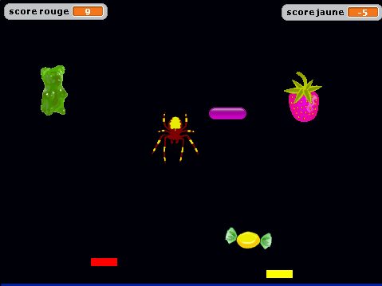

#Candy Catch est un jeu d'attrape-trucs-qui-tombent

## Principe du jeu
Le principe étant d'attraper les confiseries et fruits, ainsi que les pilules colorées, et d'éviter d'attraper les insects.  
C'est pas tant qu'ils piquent, c'est surtout qu'il faut les protéger ;).  
  

## Notions d'algo acquisent avec ce jeu

- Boucles
- Conditions
- Variables et utilisation des Variables
- Envoie et réception de message
- Détermination et utilisation d'une valeur aléatoire
- Temporisation
