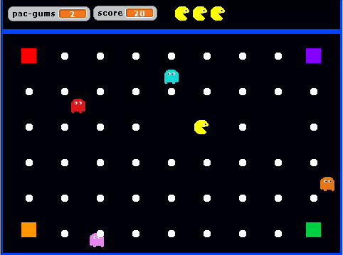
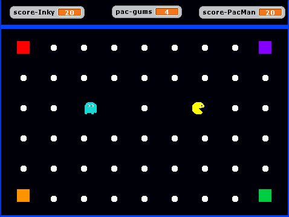

# Pac Man, un clone, simplifié, du célèbre jeu d'arcade
Dans les deux version présentées pour ce jeux, les cases colorés dans les coins de l'écran de jeu sont des téléporteurs qui envoient Pac Man à un autre téléporteur.
## Pac Man Base
### Description
Une version simplifiée, sans murs, à un joueur.  

### Notions d'algo acquisent avec ce jeu
- Boucles
- Conditions
- Variables
- Détermination et utilisation d'une valeur aléatoire
- Temporisation

## Pac Man Duel
### Description
Une version encore plus simple dans laquelle deux joueurs s'affrontent et doivent récupérer le plus de Pac Gums.  

### Notions d'algo acquisent avec ce jeu
- Boucles
- Conditions
- Variables
- Temporisation
