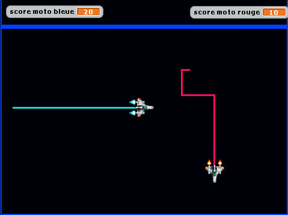

# Une version du duel de motos-lumière de Tron[1], le film des années 80
Le principe est que les vaisseaux ou motos tracent derrière eux des trait de lumière.  
Un joueur gagne le round en enfermant l'adversaire et en le faisant s'écraser sur son trait de couleur.    

[1] https://fr.wikipedia.org/wiki/Tron
